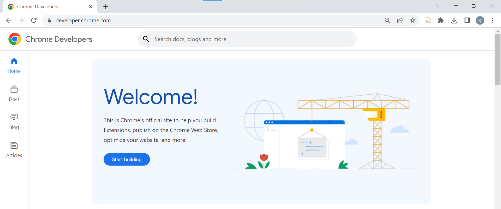

# Budget Manager Extension

## Motivation
The goal of writing this extension is to get a basic understanding of making Chrome extensions.

## Tech/Framework Used
This extension uses JSON, HTML, CSS, JS and jQuery.

## Installation
No installation is required, simply download the folder and save it on the computer that is usually not accessed. Then go to chrome://extensions/ and turn on "Developer Mode" and choose the "Load Unpacked" option. Select the folder of this extension and it will be ready to use in the toolbar.

This extension may not work at during the first attempt and may require the webpage to be refreshed.

After upload, it should appear as below: 

## How to Use
This is a very simple Chrome extension, however, it only works on the specified webpage (which has been set as https://developer.chrome.com/*) and grayed out on all other webpages.

On the specified webpage, the icon of the Chrome extension will no longer be grayed out. Clicking open the extension will give the option to select a color and that color will be applied to all `h1` tags on the page when the button "Change" is clicked.

### Appearance:

Extension in action:  

Inactive vs. Active Extension

Applying the Extension - Original:

Applying the Extension - Green `h1`:

Applying the Extension - Purple `h1`:

## Credits
This extension was created based on Udemy's Chrome Extensions: Develop 5 chrome extensions from scratch lesson by Vishwas Gopinath. (Extension 3 of 5)

## Footnotes:
*This extension was created by Zhi Rong Cai on July 12, 2022. It can be found on the Github @cat-kitty. This project is considered complete and no updates are forseeable.*

---

> **Acknowledgement of Errors**
>   It is recognized that there is a syntax error which appears:
`Manifest version 2 is deprecated, and support will be removed in 2023. See https://developer.chrome.com/blog/mv2-transition/ for more details.`
>   However, this has been recognized and ignored because it does not affect the functionality and has been ignored at this time.